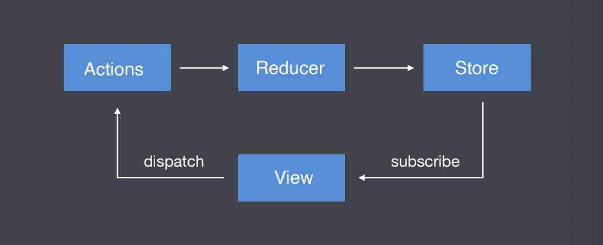
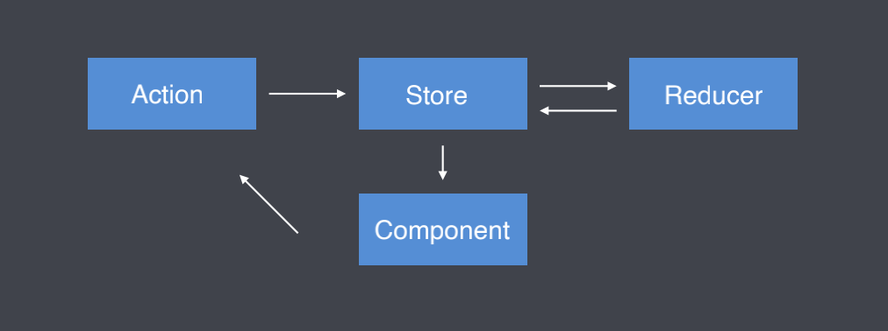
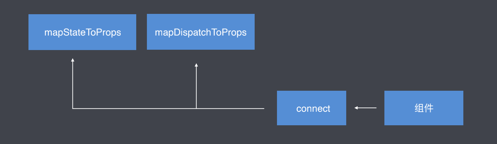

# Redux

Redux 是 JavaScript 状态容器，它提供可预测的状态管理。

## Redux 核心

### Redux 核⼼概念及⼯作流程



- `Store`:存储状态的容器，`JavaScript`对象
- `View`: 视图，`HTML`⻚⾯
- `Actions`: 对象，描述对状态进⾏怎样的操作
- `Reducers`:函数，操作状态并返回新的状态

### Redux 核心 API

```js
// 创建 Store 状态容器
const store = Redux.createStore(reducer);
// 创建用于处理状态的reducer函数
function reducer(state = initialState, action) {}
// 获取状态
store.getState();
// 订阅状态
store.subscribe(function() {});
//触发 Action
store.dispatch({ type: "description ..." });
```

## React + Redux

### Redux 工作流程

1. 组件通过 `dispatch` ⽅法触发 `Action`
2. `Store` 接收 `Action` 并将 `Action` 分发给 `Reducer`
3. `Reducer` 根据 `Action` 类型对状态进⾏更改并将更改后的状态返回给 `Store`
4. 组件订阅了 `Store` 中的状态，`Store` 中的状态更新会同步到组件

### 工作流程图



### 使用步骤

1. 创建 `Store` 和 `Reducer`

   - 创建 `Store` 需要使⽤ `createStore` ⽅法, ⽅法执⾏后的返回值就是`Store`, ⽅法需要从 `redux` 中引⼊
   - `createStore` ⽅法的第⼀个参数需要传递`reducer`
   - `reducer` 是⼀个函数, 函数返回什么, `store` 中就存储什么. 函数名称⾃定义.

   ```js
   import { createStore } from "redux";
   const store = createStore(reducer);
   function reducer() {
     return { count: 1 };
   }
   ```

2. 组件获取 `Store` 中的数据

   - 将`store`中的数据放在`Provider`组件中, `Provider`组件是存储共享数据的地⽅

   ```js
   import { Provider } from "react-redux";
   ReactDOM.render(
     <Provider store={store}>
       <App />
     </Provider>
   );
   ```

   - 组件使⽤`connect`⽅法获取数据并将数据通过`props`传递进组件

   

   ```js
   import { connect } from "react-redux";
   const mapStateToProps = (state) => ({
     count: state.count,
   });
   export default connect(mapStateToProps)(组件名称);
   ```

3. 组件更改 `Store` 中的数据

   - 定义 `action` , `action` 是改变状态的唯一途径。

   ```js
   {
     type: "描述对数据进行什么样的操作";
   }
   ```

   - 组件触发 `action`

   ```js
   this.props.dispatch({ type: "描述对数据进行什么样的操作" });
   ```

   - `reduce` 接收 `action` ,针对 `action` 对数据进行处理并返回

   ```js
   const initialState = { count: 0 };
   const reducer = (state = initialState, action) = {
     switch (action.type) {
       case "描述对数据进行什么样的操作":
         return { count: state.count + 1 };
       default:
         return state;
     }
   }
   ```

4. 为 `action` 传递参数

   - 传递参数

   ```js
   <button onClick={() => increment(5)}>+ 1</button>
   ```

   - 接收参数,传递 `reducer`

   ```js
   export const increment = (payload) => ({ type: INCREMENT, payload });
   ```

   - `reducer` 根据接收到的数据进行处理

   ```js
   export default (state, action) => {
     switch (action.type) {
       case INCREMENT:
         return { count: state.count + action.payload };
     }
   };
   ```

5. 优化

   - 使⽤ `Action Creator` 函数将触发 `Action` 的代码独⽴成函数

   ```js
   const { increment, decrement } = this.props;
   <button onClick={increment}>+1</button>
   <button onClick={decrement}>-1</button>
   ```

   ```js
   const mapDispatchToProps = (dispatch) => ({
     increment() {
       dispatch({ type: "increment count" });
     },
     decrement() {
       dispatch({ type: "decrement count" });
     },
   });
   export default connect(mapStateToProps, mapDispatchToProps)(组件名称);
   ```

   - `Action Creators` 函数绑定

   ::: tip
   触发 `Action` 的函数, 内部代码重复率⾮常⾼, 所以 `React` 提供了⽅法帮我们⽣成这些函数, 代替开发者⼿写
   :::

   ```js
   // store/actions/counter.actions.js
   export const increment = () => ({ type: "increment count" });
   export const decrement = () => ({ type: "decrement count" });
   // 组件
   import { bindActionCreators } from "redux";
   import * as counterActions from "../store/actions/counter.action";
   const mapDispatchToProps = (dispatch) => ({
     ...bindActionCreators(counterActions, dispatch),
   });
   ```

   - 将`Action`类型字符串独立成常量

   ::: tip
   `Action` 类型字符串组件在触发 `Action` 时需要使⽤, `Reducer` 在接收 `Action` 时也需要使⽤, 由于字符串不存在代码提示, 存在
   写错的⻛险, 所以要将它独⽴成常量.
   :::

   - 拆分 `Reducer`

   :::tip
   当要管理的数据越来越多时, `reducer` 中的代码将会变得越来越庞⼤.
   React 允许将⼀个⼤的 `reducer` 拆分成若⼲个⼩的 `reducer`, 最后进⾏合并使⽤.
   :::

   ```js
   import { combineReducers } from "redux";

   export default combineReducers({
     counter: counterReducer,
     user: userReducer,
   });
   /* {counter:{count:0}, user: {name: "张三", age:18}} */
   ```

## Redux 中间件

3

## Redux 常用中间件

4

## Redux 综合案例

5
