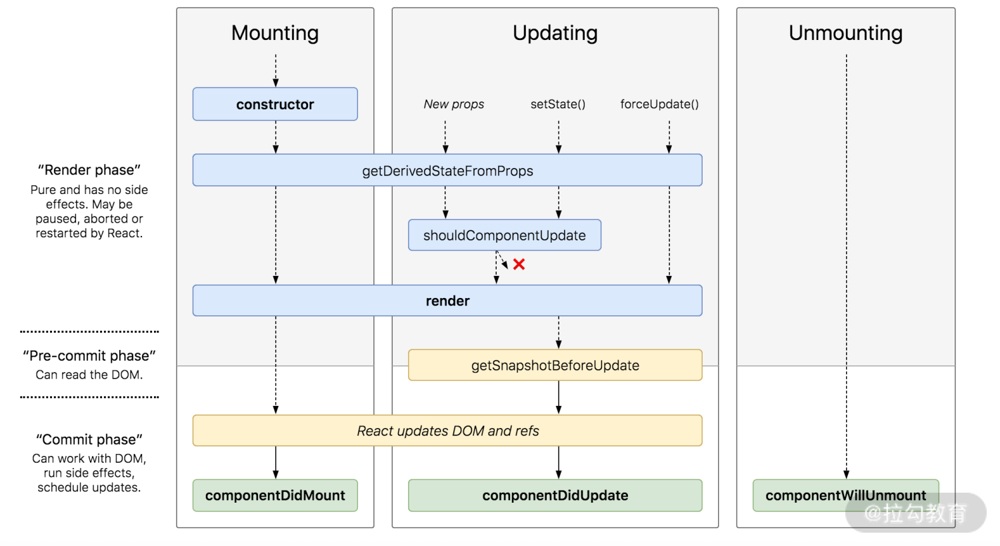

# 生命周期

## React15 的生命周期

### 周期有

- constructor()
- componentWillReceiveProps()
- shouldComponentUpdate()
- componentWillMount()
- componentWillUpdate()
- componentDidUpdate()
- componentDidMount()
- render()
- componentWillUnmount()

### 组件挂载:初始化渲染

1. `constructor()`
2. `componentWillMount()`(鸡肋，不推荐使用了)
3. `render()`
4. `componentDidMount()`
5. `组件卸载`
6. `componentWillUnmount()`

### 组件更新:由父组件触发

1. `componentWillReceiveProps()`
2. `shouldComponentUpdate()`(与 React 性能之间的关联关系)
3. `componentWillUpdate()`
4. `render()`
5. `componentDidUpdate()`
6. `组件卸载`
7. `componentWillUnmount()`

### 组件更新:由子组件触发

1. `shouldComponentUpdate()`
2. `componentWillUpdate()`
3. `render()`
4. `componentDidUpdate()`
5. `组件卸载`
6. `componentWillUnmount()`

#### 子组件

```jsx
class LifeCycle extends Component {
  constructor(props) {
    console.log("进入constructor");
    super(props);
    // state 可以在 constructor 里初始化
    this.state = { text: "子组件的文本" };
  }
  // 初始化渲染时调用
  componentWillMount() {
    console.log("componentWillMount方法执行");
  }
  // 初始化渲染时调用
  componentDidMount() {
    console.log("componentDidMount方法执行");
  }
  // 父组件修改组件的props时会调用(不严谨！！！)(由父组件的更新触发的)
  componentWillReceiveProps(nextProps) {
    console.log(
      "componentWillReceiveProps方法执行",
      this.props.text,
      nextProps.text
    );
  }
  // 组件更新时调用
  shouldComponentUpdate(nextProps, nextState) {
    console.log("shouldComponentUpdate方法执行", nextProps, nextState);
    return true;
  }

  // 组件更新时调用
  componentWillUpdate(nextProps, nextState) {
    console.log("componentWillUpdate方法执行");
  }
  // 组件更新后调用
  componentDidUpdate(preProps, preState) {
    console.log("componentDidUpdate方法执行");
  }
  // 组件卸载时调用
  componentWillUnmount() {
    console.log("子组件的componentWillUnmount方法执行");
  }
  // 点击按钮，修改子组件文本内容的方法
  changeText = () => {
    this.setState({
      text: "修改后的子组件文本",
    });
  };

  render() {
    console.log("render方法执行");
    return (
      <div className="container">
        <button onClick={this.changeText} className="changeText">
          修改子组件文本内容
        </button>
        <p className="textContent">子组件文本:{this.state.text}</p>
        <p className="fatherContent">父组件文本:{this.props.text}</p>
      </div>
    );
  }
}
```

#### 父组件

```jsx
class LifeCycleContainer extends Component {
  // state 也可以像这样用属性声明的形式初始化
  state = {
    text: "父组件的文本",
    hideChild: false,
  };

  // 点击按钮，修改父组件文本的方法
  changeText = () => {
    this.setState({
      text: "修改后的父组件文本",
    });
  };

  // 点击按钮，隐藏（卸载）LifeCycle 组件的方法
  hideChild = () => {
    this.setState({
      hideChild: true,
    });
  };

  render() {
    return (
      <div className="fatherContainer">
        <button onClick={this.changeText} className="changeText">
          修改父组件文本内容
        </button>
        <button onClick={this.hideChild} className="hideChild">
          隐藏子组件
        </button>
        {this.state.hideChild ? null : <LifeCycle text={this.state.text} />}
      </div>
    );
  }
}
```

## React16.3 的生命周期

### 16.3 生命周期


### 15 和 16.3 生命周期对比


### 组件挂载:初始化渲染

1. `constructor()`
2. `getDerivedStateFromProps`(它有且仅有一个用途：使用 props 来派生/更新 state。)
3. `render()`
4. `componentDidMount()`
5. `组件卸载`
6. `componentWillUnmount()`

#### 子组件

```jsx
class LifeCycle extends Component {
  constructor(props) {
    console.log("进入constructor");
    super(props);
    // state 可以在 constructor 里初始化
    this.state = { text: "子组件的文本" };
  }
  // 初始化/更新时调用
  static getDerivedStateFromProps(props, state) {
    console.log("getDerivedStateFromProps方法执行");
    return {
      fatherText: props.text,
    };
  }
  // 初始化渲染时调用
  componentDidMount() {
    console.log("componentDidMount方法执行");
  }
  // 组件更新时调用
  shouldComponentUpdate(prevProps, nextState) {
    console.log("shouldComponentUpdate方法执行");
    return true;
  }
  // 组件更新时调用
  getSnapshotBeforeUpdate(prevProps, prevState) {
    console.log("getSnapshotBeforeUpdate方法执行");
    return "haha";
  }
  // 组件更新后调用
  componentDidUpdate(preProps, preState, valueFromSnapshot) {
    console.log("componentDidUpdate方法执行");
    console.log("从 getSnapshotBeforeUpdate 获取到的值是", valueFromSnapshot);
  }
  // 组件卸载时调用
  componentWillUnmount() {
    console.log("子组件的componentWillUnmount方法执行");
  }
  // 点击按钮，修改子组件文本内容的方法
  changeText = () => {
    this.setState({
      text: "修改后的子组件文本",
    });
  };
  render() {
    console.log("render方法执行");
    return (
      <div className="container">
        <button onClick={this.changeText} className="changeText">
          修改子组件文本内容
        </button>
        <p className="textContent">{this.state.text}</p>
        <p className="fatherContent">{this.props.text}</p>
      </div>
    );
  }
}
```

#### 父组件

```jsx
class LifeCycleContainer extends Component {
  // state 也可以像这样用属性声明的形式初始化
  state = {
    text: "父组件的文本",
    hideChild: false,
  };
  // 点击按钮，修改父组件文本的方法
  changeText = () => {
    this.setState({
      text: "修改后的父组件文本",
    });
  };
  // 点击按钮，隐藏（卸载）LifeCycle 组件的方法
  hideChild = () => {
    this.setState({
      hideChild: true,
    });
  };
  render() {
    return (
      <div className="fatherContainer">
        <button onClick={this.changeText} className="changeText">
          修改父组件文本内容
        </button>
        <button onClick={this.hideChild} className="hideChild">
          隐藏子组件
        </button>
        {this.state.hideChild ? null : <LifeCycle text={this.state.text} />}
      </div>
    );
  }
}
```

#### getDerivedStateFromProps

1. 是一个静态方法,内部访问不到`this`.
2. 接收两个参数：`props` 和 `state`,别代表当前组件接收到的来自父组件的 `props` 和当前组件自身的 `state`.
3. 需要一个对象格式的返回值
4. 无需求，省略这个生命周期方法
5. 16.3 和 16.4 的挂载和卸载流程一致，差异在于更新流程。

- 16.4 中，任何因素触发的组件更新流程（包括由 `this.setState` 和 `forceUpdate` 触发的更新流程）都会触发
- 16.3 版本时，只有父组件的更新会触发该生命周期。

## React16.4 的生命周期

### 16.4 生命周期


